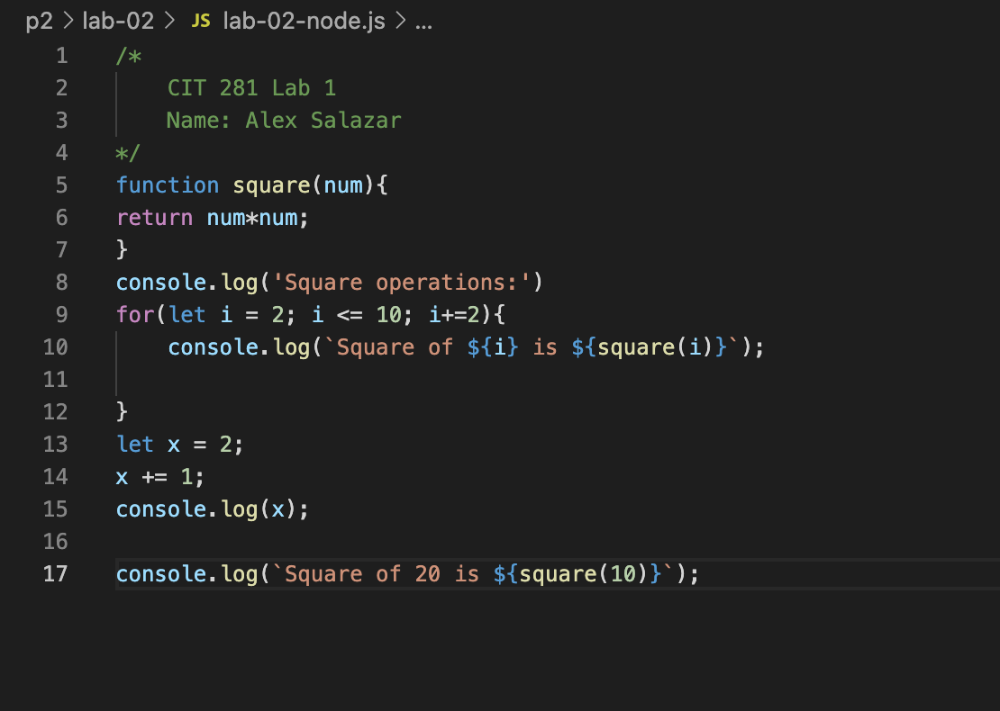

<h1>Lab-02<h1>
For this weeks lab we focused on git repoitory and learning the basic commands to use on terminal. 
Lab goals and outcomes:

Use CLI commands for directory and file manipulation
  
Use CLI commands for git commands
  
Part 1: New git repository
  
Part 2: Initial JavaScript file
  
Part 3: Add file to git
  
Part 4: Ignoring files
  
Part 5: Using diff to see changes
  
Part 6: Using wildcards
  
Part 7: Cloning cloud repos locally
  
Part 8: Branch
  
Part 9: Repo files
  

